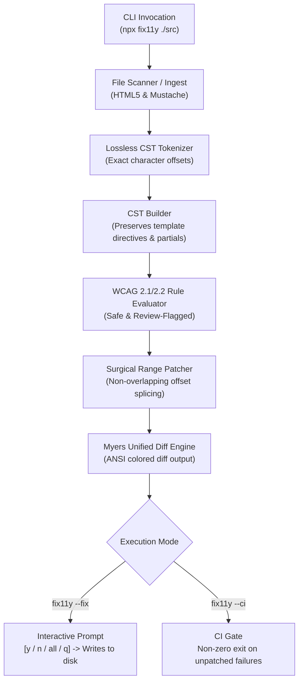

# fix11y ⚡

> **Zero-dependency, developer-focused CLI and automated accessibility remediation engine.**  
> Scans HTML5 and template files (Mustache, Handlebars), detects WCAG 2.1/2.2 AA violations, generates unified diffs, and interactively or autonomously applies non-destructive AST patches.

---

## 🚀 Why fix11y?

Most automated accessibility tools either **only report** errors (leaving developers to manually fix hundreds of issues) or use heavy AST parsers that **reserialize the entire document** upon fixing.

Reserializing an entire HTML/template document causes critical regressions:
* 💥 **Corrupts template partials** (auto-injecting `<html><head><body>` wrappers into sub-components).
* 💥 **Alters formatting** (strips custom indentation, re-quotes attributes, collapses multiline tags).
* 💥 **Destroys comments & dynamic directives** (`{{#if}}...{{/if}}` split across tags).

### The Fix: CST Offset-Based Surgical Patching
`fix11y` uses a **Concrete Syntax Tree (CST)** that records exact character offsets (`[startOffset, endOffset]`) for every tag, attribute, comment, and template token. When a violation is remediated, `fix11y` calculates surgical string splices, modifying **only** the violating character ranges while leaving 100% of surrounding whitespace, comments, quotation styles, and line endings untouched.

---

## 📦 Zero-Dependency Architecture

`fix11y` has **0 runtime dependencies and 0 dev dependencies** in `package.json`. It runs entirely on native Node.js v20+ LTS standard library modules (`node:fs`, `node:path`, `node:util`, `node:readline`, `node:test`, `node:assert`).



---

## 🎯 Supported Formats

| Format | File Extensions | Support Level |
| :--- | :--- | :--- |
| **HTML5** | `.html`, `.htm` | Full native CST support |
| **Mustache & Handlebars** | `.mustache`, `.hbs`, `.handlebars` | Full template token preservation (`{{...}}`, `{{#...}}`, `{{{...}}}`) |

---

## 🛠️ CLI Usage

```bash
# Scan a directory or file (Dry-run summary)
npx fix11y ./src

# Scan and interactively apply fixes with unified diff approval
npx fix11y ./src --fix

# Run as a CI quality gate (exit code 1 on violations, 0 on clean)
npx fix11y ./src --ci

# Output diagnostics as JSON for tooling integration
npx fix11y ./src --json
```

### Interactive Prompt Controls
When running with `--fix`, `fix11y` presents colorized unified diffs and prompts:
* `y`: Apply this patch to the file.
* `n`: Skip this patch.
* `a`: Apply all remaining patches across all files.
* `q`: Abort and quit immediately.

---

## 📋 WCAG 2.1 AA Rules & Safety Confidence Tiers

Remediations in `fix11y` are categorized into **Confidence Classes** to ensure safe automated execution:

| Rule ID | WCAG Success Criteria | Description | Safety Tier | Auto-Fix Strategy |
| :--- | :--- | :--- | :--- | :--- |
| **`rule-form-labels`** | 1.3.1 Info & Relationships, 4.1.2 Name, Role, Value | Unassociated `<input>`, `<select>`, `<textarea>` | 🟢 **Safe** | Injects deterministic `id` and creates `<label for="...">` or adds `aria-label` |
| **`rule-image-alt`** | 1.1.1 Non-text Content | Missing `alt` attribute on `` or `<area>` | 🟢 **Safe** | Injects contextual `alt=""` for decorative/button icons or placeholder review note |
| **`rule-aria-live`** | 4.1.3 Status Messages | Search/alert feedback containers missing live region | 🟢 **Safe** | Injects `aria-live="polite"` and `role="status"` |
| **`rule-semantic-buttons`** | 4.1.2 Name, Role, Value, 2.1.1 Keyboard | `<div onclick="...">` or `<a>` without `href` | 🟡 **Review-Advised** | Swaps tag to `<button type="button">`, preserving attributes & handlers |
| **`rule-landmarks`** | 1.3.1 Info & Relationships | Page missing `<header>`, `<main>`, or `<footer>` | 🟡 **Review-Advised** | Flags missing landmarks; suggests structural wraps without breaking layout |

---

## 🧪 Testing

Run the test suite using Node.js's native test runner:

```bash
npm test
```

---

## 📄 License

MIT License. Designed with zero dependencies for maximum speed, security, and stability.
