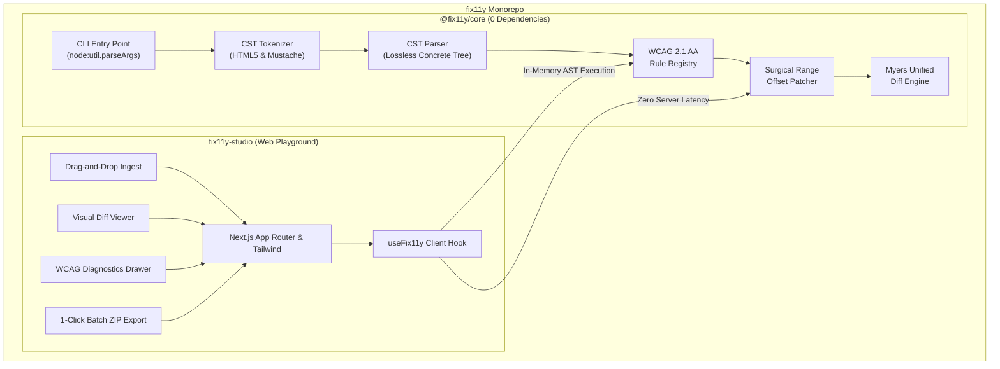

# fix11y ⚡

> **Zero-dependency, developer-focused accessibility remediation engine & interactive Web Studio.**  
> Scans HTML5 and web templates (Mustache, Handlebars), detects WCAG 2.1/2.2 AA violations, generates unified diffs, and applies surgical, non-destructive AST patches across CLI and Web environments.

[](tests/)
[](packages/core/package.json)
[](LICENSE)
[](https://www.w3.org/WAI/WCAG21/quickref/)

---

## 🌟 Dual-Interface Architecture

`fix11y` operates seamlessly across two distinct developer interfaces:

1. **`@fix11y/core` (Zero-Dependency CLI & CI Gate)**: A high-speed terminal utility and programmatic API built strictly with standard Node.js libraries (0 runtime and 0 dev dependencies).
2. **`fix11y-studio` (Visual Web Playground)**: An accessible, client-side Next.js web application with drag-and-drop template ingestion, live split-pane editors, interactive Myers diffs, and 1-click batch ZIP export.



---

## 🎯 Why fix11y? (The CST Offset Advantage)

Traditional accessibility linters either only report issues without fixing them, or attempt automated fixes by parsing HTML into an Abstract Syntax Tree (AST) and re-serializing the entire document back to string.

**Full document re-serialization introduces severe defects:**
- ❌ Destroys template partials and dynamic directives (`{{#if}}`, `{{>partial}}`).
- ❌ Strips HTML comments, DOCTYPE declarations, and conditional blocks.
- ❌ Rewrites attribute quotation styles (`'` vs `"`).
- ❌ Collapses intentional indentation and whitespace formatting.

### The fix11y Surgical Patching Solution

`fix11y` parses documents into a **Concrete Syntax Tree (CST)** that records exact character start and end indices (`startOffset`, `endOffset`) for every tag, attribute, and text node.

When remediating violations, `fix11y` applies **surgical string replacements directly to targeted character offset spans**, leaving **100% of surrounding whitespace, comments, quotation styles, and template tags intact**.

---

## 🚀 CLI Quick Start (`@fix11y/core`)

Run `fix11y` instantly in any project without installing dependencies:

```bash
# Audit a single file (dry-run mode)
npx @fix11y/core index.html

# Audit an entire directory recursively (.html, .mustache, .hbs)
npx @fix11y/core ./src

# Interactively review and apply patches
npx @fix11y/core ./templates --fix

# Non-interactive batch fix (auto-accept all patches)
npx @fix11y/core ./src --fix -y

# CI/CD Pipeline Gate (exits with code 1 on unpatched violations, 0 if clean)
npx @fix11y/core ./src --ci

# Output structured JSON diagnostic payload
npx @fix11y/core ./src --json
```

### CLI Command-Line Flags

| Flag | Shorthand | Description | Default |
| :--- | :--- | :--- | :--- |
| `--fix` | `-f` | Interactively prompt `[y/n/all/q]` to apply patches to disk | `false` |
| `--yes` | `-y` | Auto-accept all recommended patches without interactive prompt | `false` |
| `--ci` | | Non-zero exit code (1) if unpatched violations exist | `false` |
| `--safety` | `-s` | Filter rules by confidence tier: `safe` or `all` | `all` |
| `--json` | | Output parseable JSON diagnostic report to stdout | `false` |
| `--help` | `-h` | Display help screen and command options | |
| `--version` | `-v` | Display engine version | |

---

## 🎨 Web Studio (`fix11y-studio`)

The Web Playground provides a visual workbench for accessibility inspection and batch remediation:

* **⚡ Pure Client-Side Execution**: Runs `@fix11y/core` directly in browser memory via WebAssembly/ESM with zero server roundtrips, zero latency, and zero telemetry.
* **📂 Batch Drag-and-Drop Ingestion**: Drop single or dozens of `.html`, `.mustache`, and `.hbs` files at once.
* **🔍 Interactive Visual Diff Viewer**: Side-by-side split editor with synchronized line numbers and line-level colored additions/deletions.
* **📋 WCAG Diagnostics Drawer**: Rule breakdown cards with direct links to W3C specifications and click-to-jump line focus.
* **📦 1-Click ZIP Export**: Download the entire batch of remediated templates in a single ZIP file.
* **♿ Built-in Accessibility Dogfooding**: Studio interface satisfies WCAG 2.2 AA with semantic landmarks, high-contrast visual tokens, visible focus rings, and an `aria-live="polite"` screen-reader status announcer.

### Launching the Studio Locally

```bash
# Run the studio development server
npm run dev --workspace=fix11y-studio

# Build a standalone static export (out/)
npm run build --workspace=fix11y-studio
```

---

## 🛡️ WCAG 2.1 / 2.2 AA Rule Registry

| Rule ID | WCAG Criteria | Severity | Safety Tier | Automated Surgical Remediation |
| :--- | :--- | :--- | :--- | :--- |
| **`img-alt`** | [1.1.1 Non-text Content (Level A)](https://www.w3.org/WAI/WCAG21/Understanding/non-text-content.html) | Error | `Safe` | Injects contextual `alt=""` for decorative/embedded assets or transfers existing `title` values into valid `alt` attributes. |
| **`form-label`** | [1.3.1 Info & Relationships](https://www.w3.org/WAI/WCAG21/Understanding/info-and-relationships.html)<br/>[4.1.2 Name, Role, Value](https://www.w3.org/WAI/WCAG21/Understanding/name-role-value.html) | Error | `Safe` | Generates deterministic ID pairings (`<label for="id">` + `<input id="id">`) or injects `aria-label` when labels are unlinked. |
| **`button-semantics`** | [2.1.1 Keyboard (Level A)](https://www.w3.org/WAI/WCAG21/Understanding/keyboard.html)<br/>[4.1.2 Name, Role, Value](https://www.w3.org/WAI/WCAG21/Understanding/name-role-value.html) | Error | `Safe` / `Caution` | Converts clickable `div[onclick]` / `span[onclick]` into semantic `<button type="button">`, and injects accessible names on icon buttons. |
| **`aria-live-status`** | [4.1.3 Status Messages (Level AA)](https://www.w3.org/WAI/WCAG21/Understanding/status-messages.html) | Warning | `Safe` | Automatically attaches `aria-live="polite"` and `role="status"` to dynamic alert, search feedback, and live message containers. |

---

## 📦 Monorepo Directory Structure

```text
fix11y/
├── packages/
│   └── core/                 # Zero-dependency remediation engine (@fix11y/core)
│       ├── bin/
│       │   └── fix11y.js     # Standalone CLI binary (parseArgs, ANSI diffs, readline)
│       ├── src/
│       │   ├── index.js      # Public programmatic API
│       │   ├── parser/       # Character-offset Tokenizer, CST builder & Surgical patcher
│       │   ├── rules/        # WCAG 2.1 AA rule registry & mutators
│       │   └── ui/           # Pure JS Myers diff algorithm & terminal reporters
│       ├── tests/            # 37/37 native Node.js test suite & raw fixtures
│       └── package.json      # name: "@fix11y/core" (0 dependencies)
├── apps/
│   └── studio/               # Web Playground & Visual Remediation Studio
│       ├── src/
│       │   ├── app/          # Next.js App Router (page.jsx, layout.jsx, globals.css)
│       │   ├── components/   # EditorPane, DiffViewer, DiagnosticList, FileUploader, Toolbar
│       │   └── hooks/        # useFix11y client-side engine hook
│       ├── package.json      # Next.js, React, Tailwind CSS, JSZip
│       └── next.config.mjs   # transpilePackages: ['@fix11y/core'], output: 'export'
├── GEMINI.md                 # Monorepo governance & operating invariants
├── README.md                 # Documentation & Architecture guide
└── package.json              # Monorepo workspaces root
```

---

## 🧪 Testing & Verification

Run the full native test suite across the monorepo:

```bash
# Run all tests across workspaces
npm test

# Run core engine tests specifically
npm test --workspace=@fix11y/core
```

---

## 📄 License

MIT © 2026 [13Dav-arc](https://github.com/13Dav-arc)
